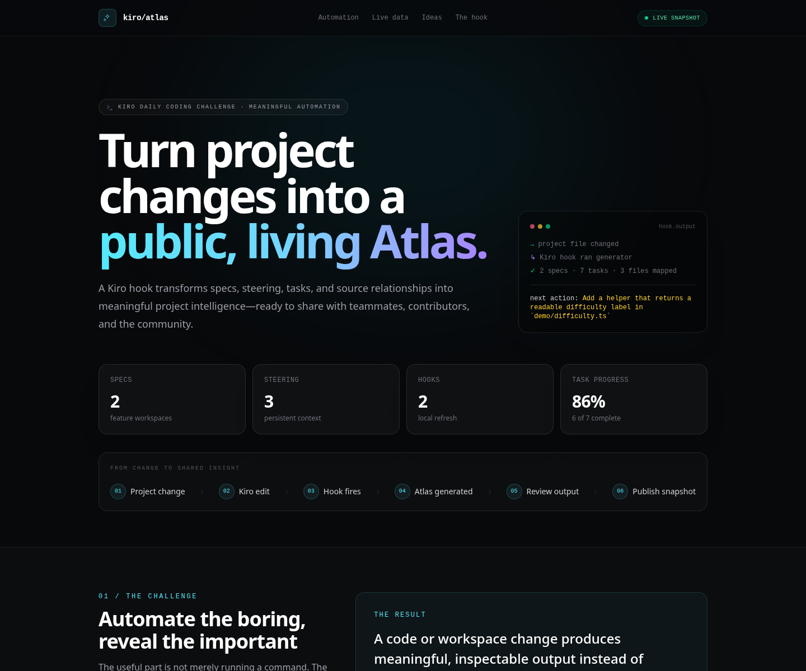

# Kiro Atlas

Kiro Atlas is a Kiro hook challenge showcase that turns committed steering, specs, tasks, hooks, and source relationships into a polished Lakebed project-intelligence page. It demonstrates how one repository change can automatically produce meaningful, visible output for teammates, contributors, and the community.

**[Open the live Kiro Atlas demo](https://quiet-garden-2148fcf4c6.staging.lakebed.app/)**



## Challenge idea

The challenge is to build a Kiro hook that automates something meaningful. Atlas uses a deterministic local generator to make normally hidden project knowledge useful outside the repository:

```text
Project change → Kiro hook → safe repository parser → generated Atlas data → Lakebed page
```

The result includes current spec progress, completed and remaining tasks, the next recommended action, persistent steering context, hook configuration, and links between specs and source files. The public page is a deployable snapshot of that generated output.

## Why it helps

Kiro's workspace is powerful, but the relationship between persistent steering, feature specs, tasks, hooks, and source code can be hard to see at first. Atlas puts that relationship on one page, measures progress, and recommends the next incomplete task.

The included **Quest Board** project is intentionally tiny: users can create quests, assign Easy, Medium, or Hard difficulty, and complete them. It exists only to give the Atlas realistic artifacts to visualize.

## How updates work

```text
Edit .kiro/ or demo/ → Kiro hook → Python generator → Atlas data → Lakebed UI
```

The hooks run `python3 scripts/generate_atlas.py`. `PostFileSave` handles normal file writes; a narrow `PostToolUse` fallback handles Kiro CLI v3 `str_replace` edits that currently bypass that event. The hooks do **not** deploy. Deployment is always a separate manual command, so automatic generation never publishes unfinished work by surprise.

## More ways to use this pattern

The same trigger → transform → share workflow could generate:

- Project progress dashboards with milestones, blockers, and ownership
- Living spec portals with requirements, decisions, and acceptance criteria
- Release-readiness views with tests, migrations, approvals, and rollout checks
- Documentation-freshness reports that flag behavior changes and affected docs
- Architecture maps and onboarding guides for new contributors
- Engineering scorecards for tests, accessibility, dependencies, and technical debt
- Stakeholder updates and public changelogs derived from repository activity
- Operational runbooks, service ownership, risks, and incident follow-ups
- Searchable decision journals explaining what changed and why

Atlas is intentionally one concrete example rather than a special-purpose platform. The reusable idea is to choose a change people care about, derive information they need, and generate an artifact they can use.

## Quick start

No Node modules need to be installed.

```sh
python3 scripts/generate_atlas.py
npx lakebed@0.0.28 dev ./capsule
```

Open the local URL printed by Lakebed.

Build the anonymous artifact:

```sh
npx lakebed@0.0.28 build ./capsule --target anonymous --out .lakebed/atlas-artifact.json
```

Start Kiro CLI v3:

```sh
kiro-cli --v3
```

## Manual deployment

The existing public demo is bound to Lakebed's staging service. Deploy manually with the exact staging release that created it:

```sh
npx lakebed@0.0.28-staging.29282560426 deploy ./capsule --json
```

Stable `0.0.28` remains the pinned version for local development and builds. Its deploy command targets production and cannot update this staging-bound deploy ID. The explicit staging version keeps showcase updates reproducible and generates the required database manifest and `maxIndexKeyBytes: 2048`. See [AGENTS.md](AGENTS.md) for the compatibility rules future coding agents should follow.

## Public-data boundary

The generator reads only these committed repository locations:

- `.kiro/steering/`
- `.kiro/specs/`
- `.kiro/hooks/`
- `demo/`
- `README.md`

It does not read `.git`, environment files, files outside the repository, the home directory, environment variables, usernames, or system information. Generated output contains repository-relative paths only. The file `capsule/shared/atlas.generated.ts` is generated and must not be edited manually.

## Demo script

1. Generate Atlas data and start Lakebed.
2. Show the one incomplete `quest-difficulty` task on the homepage.
3. Start `kiro-cli --v3` and open the `quest-difficulty` spec.
4. Implement `difficultyLabel` in `demo/difficulty.ts`.
5. Mark the final task complete in `.kiro/specs/quest-difficulty/tasks.md`.
6. Save and show `capsule/shared/atlas.generated.ts` update automatically.
7. Refresh the homepage to show full progress and the updated next step.

## Repository map

```text
.kiro/          Kiro steering, specs, and the refresh hook
demo/           Fictional Quest Board TypeScript
scripts/        Standard-library Atlas generator
capsule/        Lakebed and Preact homepage
```

This is intentionally a one-day teaching demo: the Quest Board is not a runnable application, the parser targets the included Markdown conventions, and deployment remains manual.
